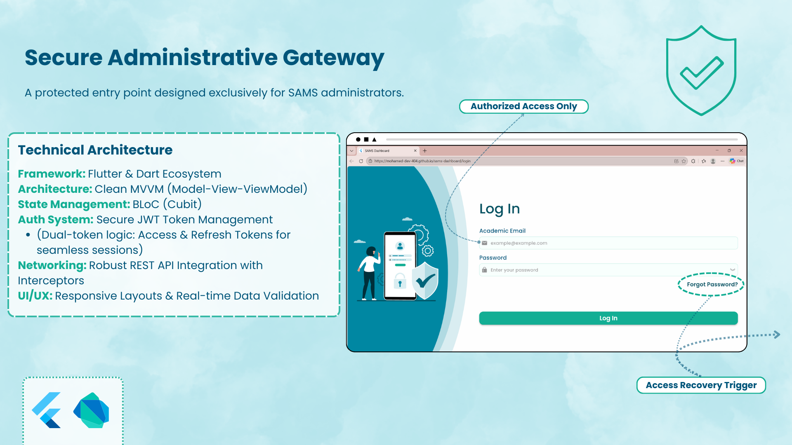
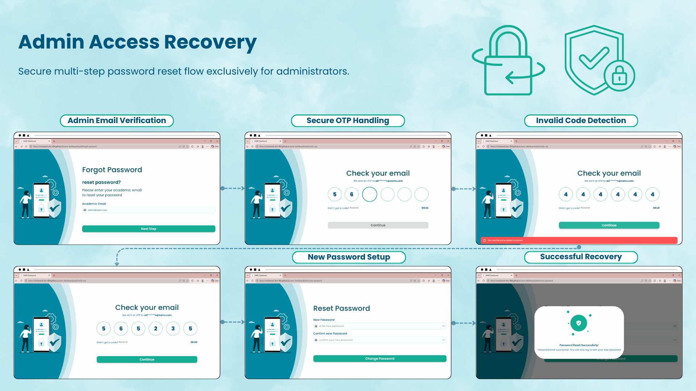
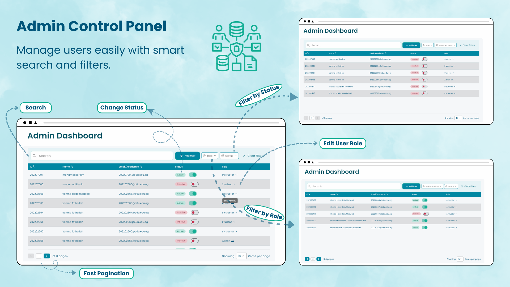
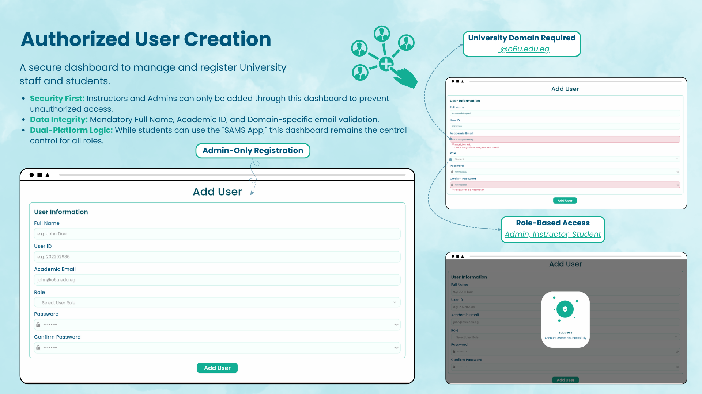

<div align="center">


<br/>

# Academiax Dashboard

### Smart Academic Management System — Admin Panel

*A secure, enterprise-grade Flutter Web dashboard for university user management.*

<br/>

[](https://flutter.dev)
[](https://dart.dev)
[](https://bloclibrary.dev/)
[](https://docs.flutter.dev/app-architecture/guide)
[](https://flutter.dev/multi-platform)
[](#license)
<a href="https://docs.flutter.dev/app-architecture/guide">
  
</a>
<a href="https://pub.dev/packages/go_router">
  
</a>
<p align="center">
  
  
  
  
  
</p>

<br/>

</div>

<div align="center">
  <a href="https://github.com/mohamed-dev-404/academiax-admin-dashboard">
    
  </a>
</div>


<div align="center">
  <table>
    <tr>
      <td align="center" width="50%">
        <b>🔐 Secure Gateway & Authentication</b><br>
        <i>Enterprise-grade login with dual JWT token management and role-based access control (RBAC)</i><br>
        
      </td>
      <td align="center" width="50%">
        <b>🛡 Identity Recovery Ecosystem</b><br>
        <i>Multi-step OTP verification & secure password reset workflow with client-side validation</i><br>
        
      </td>
    </tr>
    <tr>
      <td align="center" width="50%">
        <b>📊 Centralized Operations Intelligence</b><br>
        <i>High-density data grid with real-time Optimistic UI updates, global search, advanced filtering, and inline role management</i><br>
        
      </td>
      <td align="center" width="50%">
        <b>👤 Administrative Onboarding Engine</b><br>
        <i>Efficient user provisioning with multi-role support, activation/deactivation, strict validation, and immediate UI feedback</i><br>
        
      </td>
    </tr>
  </table>
</div>

---

## 🎥 Demo Video

Showcasing **Optimistic UI interactions**, authentication, user management, role transitions, and responsive interface.

<div align="center">

 </div>


<br/>

---

## 📋 Table of Contents

<br>

**🔷 Overview**

| | Section | |
|:--:|:--|:--|
| 📌 | [About the Project](#-about-the-project) | `Overview` |
| 🚀 | [Key Capabilities](#-key-capabilities) | `Highlights` |

<br>

**⚙️ Technical**

| | Section | |
|:--:|:--|:--|
| 🏗 | [Architecture](#-architecture) | `MVVM · Repository` |
| 📂 | [Project Structure](#-project-structure) | `lib/ tree` |
| 🔐 | [Authentication & Security](#-authentication--security) | `Dual JWT · Token Refresh` |
| 🌐 | [Network Layer](#-network-layer) | `Dio · Interceptors` |
| 🧠 | [State Management](#-state-management) | `Cubit · BLoC` |
| 🧭 | [Routing](#-routing) | `go_router` |
| 🛠 | [Tech Stack](#-tech-stack) | `Packages & Plugins` |

<br>

**📦 Resources**

| | Section | |
|:--:|:--|:--|
| 📸 | [System Showcase](#-system-showcase) | `Screenshots` |
| 📊 | [Dashboard Capabilities](#-dashboard-capabilities) | `User Management · Data Tables` |
| 📱 | [Responsive Design](#-responsive-design) | `Web · Tablet · Desktop` |
| 🧪 | [Scalability & Extensibility](#-scalability--extensibility) | `Future Expansion` |
| 🔗 | [Related Repositories](#-related-repositories) | `Flutter · NestJS · Python` |
| 👥 | [Contributors](#-contributors) | `2 contributors` |
| 🏆 | [Conclusion](#-conclusion) | `Summary` |

---

## 📌 About the Project

The **Academiax Administrative Dashboard** is a secure, role-based web platform engineered to centralize university user management for **System Administrators**. Designed for enterprise-scale usage, the system emphasizes **security, performance, and extensibility**, while delivering a clean, intuitive, and responsive administrative experience.

A key UX enhancement is the integration of **Optimistic UI**, enabling instant feedback for user actions such as role changes, activation/deactivation, and data updates — even before the server confirms the operation. This ensures a **smooth, seamless experience** for administrators, particularly when working with large datasets.

---

## 🚀 Key Capabilities

* 👥 **User Lifecycle Management:** Create, activate, deactivate, and maintain accounts for students, instructors, and staff.
* 🔐 **Secure Authentication & Session Handling:** Enforce enterprise-grade JWT-based login with dual-token logic and session persistence.
* 🔄 **Dynamic Role Assignment & Optimistic UI:** Seamlessly assign, modify, and manage user roles with immediate interface feedback, improving workflow efficiency.
* 🔍 **Advanced Data Control:** Efficiently search, filter, and paginate large datasets with real-time updates.
* ⚙️ **Enterprise-Scale Optimization:** Designed for scalability, maintainability, and high-performance operations across Web, Tablet, and Desktop platforms.

> This platform serves as a centralized control hub, enabling administrators to manage users efficiently while maintaining the highest security, usability, and responsiveness standards.

---

## 🏗 Architecture

The application strictly follows **MVVM** principles combined with the **Repository Pattern** for full data-source abstraction and testability.

```
💻 Presentation Layer → Flutter UI + Cubits (ViewModels)
⚙️ Core Layer         → Network, Caching, Error Handling, Utilities
```

### Architectural Highlights

* Feature-based modular structure
* Repository pattern with abstraction
* Decoupled business logic
* Scalable and test-friendly design
* Centralized error handling

---

## 📂 Project Structure

```
lib/
├── core/
│   ├── cache/
│   ├── errors/
│   ├── network/
│   │   └── interceptors/
│   ├── utils/
│   └── widgets/
└── features/
    ├── auth/
    └── home/
```

### Core Layer

Contains shared infrastructure:

* 🌐 Network abstraction (Dio + interceptors)
* 🔒 Secure & local storage
* 🛠 Error handling & logging
* 🧭 Routing configuration
* 🎨 Theming & reusable widgets

### Features Layer

Each feature contains:

* `data/` → models & repository implementations
* `presentation/` → Cubits & UI

---

## 🔐 Authentication & Security

### Dual JWT Token Strategy

The system implements a **secure Access/Refresh token mechanism**.

#### 🔁 Automated Token Refresh Flow

1. API returns `401 Unauthorized`
2. `AuthInterceptor` intercepts the error
3. Refresh token request is triggered
4. Failed requests are queued
5. New access token is stored securely
6. All queued requests are retried automatically

#### Security Enhancements

* 🔒 Flutter Secure Storage → Sensitive token storage
* ⚡ GetStorage → Lightweight fast caching
* 🧠 Concurrent-safe refresh logic (prevents multiple refresh calls)
* 🛡 Automatic session invalidation if refresh fails

This ensures uninterrupted user experience with maximum security.

---

## 🌐 Network Layer

Built on **Dio** with layered interceptors:

* AuthInterceptor
* RetryInterceptor
* HeaderInterceptor
* Logging Interceptor
* Network Connectivity Interceptor

Features:

* Centralized error mapping
* Automatic retry handling
* Clean API abstraction via `ApiConsumer`
* Reduced boilerplate across repositories

---

## 🧠 State Management

Uses **flutter_bloc (Cubit)** for:

* Predictable state transitions
* Clear loading/success/error flows
* Decoupled UI from business logic
* Efficient rebuild management

Each feature maintains isolated Cubits for scalability.

---

## 🧭 Routing

Declarative routing using **go_router**.

* Protected authenticated flows
* Shared layout using ShellRoute
* Clean separation between Auth and Dashboard routes
* Role-based navigation support

---

## 🛠 Tech Stack

| Category | Technology |
|---|---|
| Framework | Flutter Web |
| Architecture | MVVM + Repository Pattern |
| State Management | flutter_bloc (Cubit) |
| Networking | Dio |
| Routing | go_router |
| Local Storage | Flutter Secure Storage, GetStorage |
| Data Tables | data_table_2 |
| Responsiveness | flutter_screenutil |
| CI/CD | Automated Pipeline |

---

## 📸 System Showcase

Visual overview of the **SAMS Admin Dashboard**, highlighting core modules, **Optimistic UI interactions**, and enterprise-grade workflows.

<div align="center">
  <table>
    <tr>
      <td align="center">
        <b>🔐 Secure Gateway & Authentication</b><br>
        <i>Enterprise-grade login with dual JWT token management and role-based access control (RBAC)</i><br>
        
      </td>
      <td align="center">
        <b>🛡 Identity Recovery Ecosystem</b><br>
        <i>Multi-step OTP verification & secure password reset workflow with client-side validation</i><br>
        
      </td>
    </tr>
    <tr>
      <td align="center">
        <b>📊 Centralized Operations Intelligence</b><br>
        <i>High-density data grid with real-time Optimistic UI updates, global search, advanced filtering, and inline role management</i><br>
        
      </td>
      <td align="center">
        <b>👤 Administrative Onboarding Engine</b><br>
        <i>Efficient user provisioning with multi-role support, activation/deactivation, strict validation, and immediate UI feedback</i><br>
        
      </td>
    </tr>
  </table>
</div>

---


## 📊 Dashboard Capabilities

### 👥 User Management

Administrators can:

* Create new users
* Activate/Deactivate accounts instantly
* Dynamically switch user roles (e.g., Student ↔ Instructor)
* Perform global search
* Filter by role & status
* Navigate paginated high-density data tables

### 📋 Data Table Features

* Optimized for web
* Dynamic pagination
* Inline role modification
* Status badges
* High-performance rendering

---

## 📱 Responsive Design

Built using:

* `flutter_screenutil`
* Adaptive layout logic

Supports:

* Desktop Web
* Tablet
* Mobile Web

Ensures consistent UI/UX across all screen sizes.

---

## 🚀 CI/CD Pipeline

Integrated with an automated pipeline:

* Code validation
* Automated testing
* Build verification
* Deployment automation

Ensures production stability and faster iteration cycles.

---

## 🧪 Scalability & Extensibility

The architecture supports easy expansion:

* Role-based permissions system
* Audit logs
* Analytics dashboard
* Multi-tenant support
* Feature toggling

Without refactoring core layers.

---

## 🔗 Related Repositories

This Admin Dashboard is part of a four-component system:

| Repository | Description | Link |
|---|---|---|
| **Flutter Client** | Cross-platform mobile & web application (iOS · Android · Web) | [mohamed-dev-404/academiax](https://github.com/mohamed-dev-404/academiax) |
| **Admin Dashboard** *(this repo)* | Flutter Web-only admin panel · MVVM · CI/CD pipeline · User & role management | Current Repository |
| **Backend API** | NestJS REST API · MongoDB · Redis · JWT Auth | [gemmy404/sams-api](https://github.com/gemmy404/sams-api) |
| **AI Plagiarism Engine** | Python NLP microservice · Sentence Transformers | [mohammedeissa7/plagiarism_project](https://github.com/mohammedeissa7/plagiarism_project) |

---

## 👥 Contributors

<table>
<tr>
<td align="center">
  <a href="https://github.com/mohamed-dev-404">
    <br/>
    <sub><b>Mohamed Ibrahim</b></sub>
  </a>
</td>
<td align="center">
  <a href="https://github.com/Yomna-Abdelmegeed">
    <br/>
    <sub><b>Yomna Abdelmegeed</b></sub>
  </a>
</td>
</tr>
</table>

---

## 🏆 Conclusion

This project demonstrates a **production-ready, enterprise-level Flutter Web solution**, focusing on:

* 🔐 Security-first architecture
* 🧱 Clean engineering standards
* ⚡ Performance optimization
* 📈 Scalability
* 🔄 Modern CI/CD practices

It reflects a real-world, industry-grade approach to building secure administrative systems using Flutter.

---

<div align="center">

Made with ❤️ using Flutter

</div>